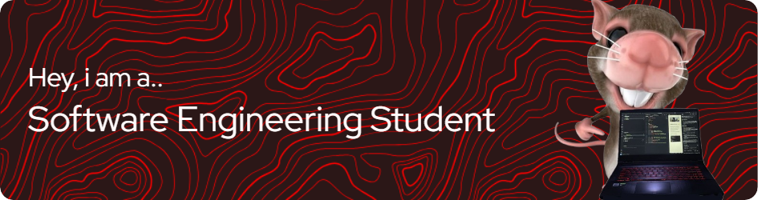

  

I build things that (sometimes) work and (often) break.</h2>

###

<h3 align="center">Currently juggling life & Building stuff (and occasionally breaking it) with</h3>

###
 

  
  
  
  
  
  
  
  
  
  
  
  
  
  
  
  
  
  
  
  
  
  
  

 

<h3 align="center">Catch me here</h3>

  
  
  
  
  

 
 
 

  

    

  

 
 

  

